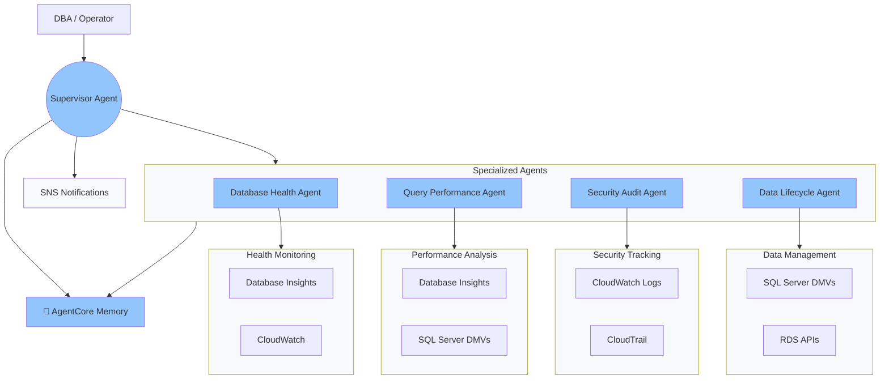

# Autonomous DBOps: Agentic AI for Maintaining Databases

  

This repo is a ready-to-deploy multi-agent system for autonomous database operations on Amazon RDS for SQL Server. Built with the [Strands Agents](https://github.com/strands-agents/sdk-python) framework and deployed on [Amazon Bedrock AgentCore](https://docs.aws.amazon.com/bedrock-agentcore/latest/devguide/what-is-bedrock-agentcore.html), it includes 5 specialized agents with `@tool` decorated functions that query DMVs, CloudWatch, Database Insights, CloudTrail, and RDS APIs, CloudFormation templates for infrastructure and IAM, and [AgentCore Memory](https://docs.aws.amazon.com/bedrock-agentcore/latest/devguide/memory.html) for cross-session knowledge retention using [memory strategies](https://docs.aws.amazon.com/bedrock-agentcore/latest/devguide/memory-strategies.html) — combining [semantic](https://docs.aws.amazon.com/bedrock-agentcore/latest/devguide/semantic-memory-strategy.html) extraction for operational facts with [summarization](https://docs.aws.amazon.com/bedrock-agentcore/latest/devguide/summary-strategy.html) for historical investigation context.

Deploy to AgentCore in private subnets with least-privilege IAM. Enable GenAI Observability with OpenTelemetry auto-instrumentation and a custom CloudWatch dashboard for real-time agent metrics and token tracking. Validate agents by diagnosing real performance issues on a live RDS SQL Server database.

## What's Included

### SQL Server

| Agent | Tools | Data Sources | Key Capabilities | Status |
|-------|-------|-------------|-----------------|--------|
| [📊 Database Health](db-engines/sql-server#database-health-tools-14) | 14 | CloudWatch, Database Insights | CPU, memory, connections, wait events, IOPS, latency | ✅ Ready |
| [⚡ Query Performance](db-engines/sql-server#query-performance-tools-13) | 13 | SQL Server DMVs, Query Store | Slow queries, blocking, missing indexes, query plans | ✅ Ready |
| [🔒 Security Audit](db-engines/sql-server#security-audit-tools-8) | 8 | CloudWatch Logs, CloudTrail, RDS API | Failed logins, encryption status, config changes | ✅ Ready |
| [💾 Data Lifecycle](db-engines/sql-server#data-lifecycle-tools-25) | 25 | SQL Server DMVs, CloudWatch, RDS API | Table sizes, backups, TempDB, storage trends | ✅ Ready |
| [🎯 Supervisor](db-engines/sql-server#supervisor-tools-10) | 10 | A2A orchestration | Routes queries, correlates findings, daily reports | ✅ Ready |

## Architecture



### How It Works

| Step | What Happens |
|------|-------------|
| 1️⃣ Invoke | Operator calls an agent via `agentcore invoke --agent <name>` |
| 2️⃣ Route | Supervisor dispatches to sub-agent(s) via A2A |
| 3️⃣ Execute | Sub-agents run `@tool` functions against AWS APIs |
| 4️⃣ Reason | Claude analyzes outputs and decides next steps |
| 5️⃣ Remember | Semantic extraction saves facts, summarization condenses sessions |
| 6️⃣ Recall | Supervisor retrieves findings from previous sessions |

### Agent Responsibilities

| Agent | What It Monitors | Data Sources | Key Tools |
|-------|-----------------|-------------|-----------|
| 📊 **Database Health** | CPU, memory, connections, wait events, IOPS, latency | Database Insights, CloudWatch | `get_database_load`, `get_wait_events`, `get_cpu_utilization` |
| ⚡ **Query Performance** | Slow queries, blocking, missing indexes, plan regressions | SQL Server DMVs, Query Store | `get_query_store_top_queries`, `get_blocking_sessions`, `suggest_indexes` |
| 🔒 **Security Audit** | Encryption, failed logins, config changes, compliance | RDS API, CloudWatch Logs, CloudTrail | `check_tde_status`, `get_failed_login_attempts`, `check_rds_security_settings` |
| 💾 **Data Lifecycle** | Storage growth, TempDB bottlenecks, fragmentation, backups | CloudWatch, DMVs, RDS API | `analyze_tempdb_bottleneck`, `recommend_storage_upgrade`, `get_table_sizes` |
| 🎯 **Supervisor** | Orchestration, correlation, daily reports | A2A to all 4 agents | `invoke_health_check`, `generate_daily_report`, `invoke_custom_agent_query` |

## Memory

All agents share a single [AgentCore Memory](https://docs.aws.amazon.com/bedrock-agentcore/latest/devguide/memory.html) instance with two strategies:

- **Semantic Strategy** — Extracts and stores factual findings (e.g., "CPU spiked to 87% at 14:30 UTC") across all agent sessions. Enables cross-agent knowledge recall without re-running tools.
- **Summarization Strategy** — Condenses each investigation session into a summary for efficient context retrieval in future sessions.

Memory is created automatically by `deploy.sh` via `scripts/setup_memory.py`. All agents connect to the same shared memory using the `MEMORY_ID` environment variable.

```
Session 1: Health Agent finds CPU at 87%
    │
    ▼
🧠 Semantic: stores "CPU utilization reached 87% at 14:30 UTC"
🧠 Summary: "Investigated CPU spike, found correlation with blocking queries"
    │
    ▼
Session 2: Supervisor asked "what happened today?"
    │
    ▼
🧠 Recalls CPU finding + session summary without re-running tools
```

## Repository Structure

| Path | Description |
|------|-------------|
| 📜 `deploy.sh` | Deploys shared memory + all 5 agents |
| 📜 `.env` | Your environment variables (see Quick Start) |
| **db-engines/sql-server/** | |
| ├── 🤖 `agents/` | Agent definitions (5 agents) |
| ├── 🔧 `tools/` | `@tool` functions grouped by domain + `shared_utils.py` |
| ├── ⚙️ `config/settings.py` | All configuration in one place |
| └── 📦 `requirements.txt` | Python dependencies |
| **scripts/** | |
| ├── ✅ `validate_prerequisites.py` | Checks infra requirements (Option B) |
| ├── 🧠 `setup_memory.py` | Creates shared memory |
| └── 🧹 `cleanup_agents.py` | Deletes agents + shared memory |
| **templates/** | CloudFormation templates |
| ├── 🏗️ `infrastructure.yaml` | VPC, RDS, VPC endpoints, SNS, bastion |
| ├── 🔐 `agentcore-role.yaml` | IAM execution role for agents |
| └── 🌐 `vpc-endpoints.yaml` | Standalone VPC endpoints (existing VPCs) |
| **documentation/** | Guides and architecture docs |

## Quick Start

### Prerequisites

- AWS account with Amazon Bedrock model access (Claude Sonnet)
- Amazon RDS for SQL Server instance (see [Infrastructure Setup](#2-infrastructure-setup) below)
- Python 3.10+
- [AgentCore Starter Toolkit](https://aws.github.io/bedrock-agentcore-starter-toolkit/) installed:
  ```bash
  pip install bedrock-agentcore-starter-toolkit
  ```

### 1. Clone and set up

```bash
git clone <your-repo-url>
cd agentic-db-ops

# Create Python virtual environment
python3 -m venv .venv
source .venv/bin/activate
pip install -r db-engines/sql-server/requirements.txt
```

### 2. Infrastructure setup

You have two options depending on whether you already have an RDS SQL Server instance.

#### Option A: Deploy everything with CloudFormation (recommended for new setups)

This creates a VPC, private subnets, VPC endpoints, RDS SQL Server, SNS topic, and a Windows bastion host.

```bash
aws cloudformation deploy \
  --template-file templates/infrastructure.yaml \
  --stack-name dbops-infra \
  --capabilities CAPABILITY_NAMED_IAM \
  --parameter-overrides AlertEmail=your-email@example.com
```

After the stack completes, proceed to Step 3 to create the IAM role, then generate your `.env` file in Step 4.

#### Option B: Use your existing RDS SQL Server

Your existing setup needs:
- An RDS SQL Server instance with Database Insights enabled and CloudWatch Logs exports (`error`, `agent`)
- A Secrets Manager secret with database `username` and `password`
- At least one private subnet with a security group allowing outbound 443 and inbound 1433 to RDS
- VPC endpoints (or a NAT gateway) for AWS service access
- An SNS topic for alerts (optional)

First create your `.env` file with the required variables:

```bash
cat > .env << 'EOF'
export DB_INSTANCE_ID=your-rds-instance-id
export DB_SECRET_ID=arn:aws:secretsmanager:us-east-1:123456789012:secret:your-secret-name
export AWS_REGION=us-east-1
export SNS_TOPIC_NAME=your-sns-topic-name
export SECURITY_GROUP_ID=sg-xxxxxxxxx
export SUBNET1=subnet-xxxxxxxxx
export AGENTCORE_ROLE_ARN=arn:aws:iam::123456789012:role/AgentCoreDBOpsRole
EOF
```

Then run the prerequisites validator:

```bash
source .env && source .venv/bin/activate
python3 scripts/validate_prerequisites.py
```

This checks your networking, security groups, RDS configuration, and secrets. Fix any failures before proceeding.

If your private subnets don't have a NAT gateway, deploy VPC endpoints:

  ```bash
  aws cloudformation deploy \
    --template-file templates/vpc-endpoints.yaml \
    --stack-name dbops-vpc-endpoints \
    --parameter-overrides \
      VpcId=vpc-xxxxxxxxx \
      PrivateSubnetIds=subnet-xxxxxxxxx,subnet-yyyyyyyyy \
      VpcCidr=10.0.0.0/16 \
      PrivateRouteTableId=rtb-xxxxxxxxx
  ```

  > **Note:** If your private subnets already have a NAT gateway, you can skip VPC endpoints — agents will reach AWS services through the NAT. However, VPC endpoints are recommended to keep traffic on the AWS network and avoid NAT data processing costs.

### 3. Create the IAM execution role

```bash
aws cloudformation deploy \
  --template-file templates/agentcore-role.yaml \
  --stack-name dbops-agentcore-role \
  --capabilities CAPABILITY_NAMED_IAM
```

### 4. Configure environment variables

If you used **Option A**, generate your `.env` file from both CloudFormation stacks:

```bash
eval $(aws cloudformation describe-stacks --stack-name dbops-infra \
  --query 'Stacks[0].Outputs[*].[OutputKey,OutputValue]' --output text | \
  awk '{print $1"="$2}')

ROLE_ARN=$(aws cloudformation describe-stacks --stack-name dbops-agentcore-role \
  --query 'Stacks[0].Outputs[?OutputKey==`RoleArn`].OutputValue' --output text)

cat > .env << EOF
export DB_INSTANCE_ID=$DBInstanceId
export DB_SECRET_ID=$DBSecretId
export AWS_REGION=us-east-1
export SNS_TOPIC_NAME=$SNSTopicName
export SECURITY_GROUP_ID=$SecurityGroupId
export SUBNET1=$Subnet1
export AGENTCORE_ROLE_ARN=$ROLE_ARN
EOF
```

If you used **Option B**, add the role ARN to your existing `.env`:

```bash
ROLE_ARN=$(aws cloudformation describe-stacks --stack-name dbops-agentcore-role \
  --query 'Stacks[0].Outputs[?OutputKey==`RoleArn`].OutputValue' --output text)

echo "export AGENTCORE_ROLE_ARN=$ROLE_ARN" >> .env
```

### 5. Deploy all agents

```bash
./deploy.sh
```

This script:
1. Creates shared memory with semantic + summarization strategies
2. Deploys all 5 agents to AgentCore Runtime in your private subnet
3. Resolves sub-agent ARNs and passes them to the Supervisor
4. Automatically updates `.env` with the new agent ARNs
5. Generates `.bedrock_agentcore.yaml` for `agentcore invoke` CLI usage

### 6. Start using

Start with the Supervisor agent — it routes your request to the right sub-agent(s) automatically:

```bash
# Full investigation (Supervisor routes to sub-agents and correlates findings)
agentcore invoke --agent supervisor_agent '{"prompt": "Give me a complete database health report"}'

# Ask anything — Supervisor decides which agents to call
agentcore invoke --agent supervisor_agent '{"prompt": "Why is the database slow?"}'
agentcore invoke --agent supervisor_agent '{"prompt": "Run a security audit"}'
```

You can also call individual agents directly if you know which domain you need:

```bash
agentcore invoke --agent database_health_agent '{"prompt": "What is the current CPU utilization?"}'
agentcore invoke --agent query_performance_agent '{"prompt": "Show me the top 5 slowest queries"}'
agentcore invoke --agent security_audit_agent '{"prompt": "Check TDE encryption status"}'
agentcore invoke --agent data_lifecycle_agent '{"prompt": "What are the current table sizes?"}'
```

### 7. Cleanup

```bash
# Remove all agents and shared memory
source .env && source .venv/bin/activate
python3 scripts/cleanup_agents.py

# Remove VPC endpoints (if you deployed with Option B)
aws cloudformation delete-stack --stack-name dbops-vpc-endpoints

# Remove IAM role
aws cloudformation delete-stack --stack-name dbops-agentcore-role

# Remove infrastructure (if you deployed with Option A)
aws cloudformation delete-stack --stack-name dbops-infra
```

> **Note:** AgentCore VPC ENIs are shared resources that may persist for up to 8 hours after agent deletion. If the infrastructure stack delete fails due to ENI dependencies on the subnet or security group, wait for the ENIs to be auto-released and retry.

## Networking

All agents run in private subnets with no internet access. AWS service communication happens exclusively through VPC endpoints. This keeps all traffic on the AWS network and eliminates the need for a NAT gateway.

See [config/settings.py](db-engines/sql-server/config/settings.py) for the full VPC endpoint list with descriptions of which agent uses each endpoint.

## IAM

The AgentCore execution role (`templates/agentcore-role.yaml`) follows least-privilege principles:

- Bedrock model invocation (Claude Sonnet)
- A2A agent invocation (Supervisor → sub-agents)
- Database Insights read access
- CloudWatch metrics and logs read access
- RDS describe operations (read-only)
- Secrets Manager read access (DB credentials)
- SNS publish (alert notifications)
- CloudTrail lookup (security audit)
- AgentCore Memory read/write

See [templates/README.md](templates/README.md) for setup instructions.

## Configuration

All configuration lives in [`config/settings.py`](db-engines/sql-server/config/settings.py). Values are read from environment variables set in `.env`. See [config/README.md](db-engines/sql-server/config/README.md) for the full list.

## Contributing

We welcome contributions for:
- Additional tools for existing agents
- New database engine support
- Improved memory strategies
- CloudFormation template enhancements

## Resources

- [Amazon Bedrock AgentCore Documentation](https://docs.aws.amazon.com/bedrock-agentcore/latest/devguide/what-is-bedrock-agentcore.html)
- [AgentCore Memory](https://docs.aws.amazon.com/bedrock-agentcore/latest/devguide/memory.html)
- [Strands Agents SDK](https://github.com/strands-agents/sdk-python)
- [AgentCore Memory Session Manager](https://docs.aws.amazon.com/bedrock-agentcore/latest/devguide/strands-sdk-memory.html)

## Disclaimer

This is sample code for educational purposes only. It should not be used in production accounts, on production workloads, or on production data. Assess the security of this solution before deploying it. AWS code samples are provided "as is" without warranty of any kind, either expressed or implied. These examples are intended to help customers use AWS services in their applications and should be thoroughly tested, secured, and optimized according to your organization's security standards and policies before any production use.

## Security

See [CONTRIBUTING](CONTRIBUTING.md#security-issue-notifications) for how to report security issues, and [SECURITY](SECURITY.md) for bastion host hardening and S3 bucket recommendations.

## License

This project is licensed under the MIT License.
